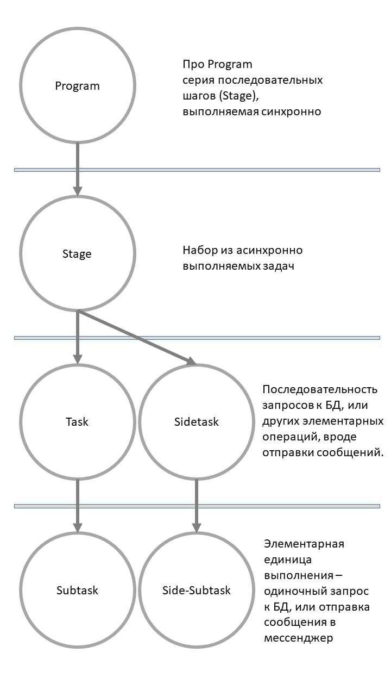

# Hard Work - Формализуем многослойную (многоуровневую) архитектуру

## Пример проекта, похожего на МУРА

Есть небольшой проект, который я недавно как раз переписал с чистого листа - сервис для создания аналитических отчетов из данных в БД. Действия, выполняемые сервисом попробуем описать от самого базового (нижнего) уровня к более высоким:

- Задача сводится к выполнению ряда запросов к БД и получению данных. Таким образом, самым "нижним" слоем будет отдельный запрос к БД (`Subtask`). Чуть позже пришли к пониманию, что это также может быть отправка сообщения в мессенджер, или отправка письма, назовем это `Side-Subtask`.
- Последовательная серия запросов (синхронных), которые необходимы для получения минимального отчета - это уже отдельная задача (Task). Например: обновить справочник в клиентской БД, обновить ежедневные данные. Или сформировать отчет, затем оправить его по почте (Sidetask).
- Все эти `Task` могут выполняться значительное время (например, ждем выполнения большого запроса к БД), поэтому разумно выполнять несколько таких задач за один раз. Поэтому сделаем выполнение `Task` асинхронным (и все что ниже по уровню магическим образом тоже превращается в асинхронные функции :)). Назовем набор параллельно выполняемых тасков этапом `Stage`.
- Отдельные задачи зависят от выполнения друг-друга и должны выполняться последовательно. Последовательность выполнения `Stage`, уже синхронную, назовем `Program`.

## Диаграмма МУРА (при условии строгости)

В целом при некоторых исправлениях получилось сделать так, что каждый слой зависит только непосредственно от одного нижнего. Ранее, например, для запуска подзадач, эта подзадача могла "запрашивать" параметры для выполнения (например, даты отчетов), но относительно несложно сделать так, чтобы параметры спускались сверху-вниз по уровням.

В сервисе можно выделить следующие слои, от верхнего к нижнему:

1. `Program`
2. `Stage`
3. `Task / Sidetask`
4. `Subtask / Side-Subtask`

Получается диаграмма следующего вида:

## Выводы

Учитывая, насколько быстро даже небольшие проекты становятся запутанными и их элементы начитают зависеть рекурсивно друг от друга, мышление о программе в формате "ациклического направленного графа" действительно помогло мне сделать написание приложения заметно проще.
Большой плюс, что всю итоговую конструкцию достаточно легко:

- модифицировать, добавляя новый узел на уровень, зная, что в идеале это не потянет за собой никаких изменений на других уровнях.
- взять все приложение целиком, и сделать его частью (узлом) другой системы, например системы автоматизации.

Все эти моменты работают за счет слабой связанности элементов, причем эта слабая связанность продолжает работать даже когда мы поднимаемся от низкоуровневых элементов к целым подсистемам.
Впредь при написании новых программ буду в первую очередь думать о переиспользовании уже существующего когда и о том, что новый код также нужно планировать и проектировать как отдельную деталь, которую можно сделать составным элементом более крупных проектов.
